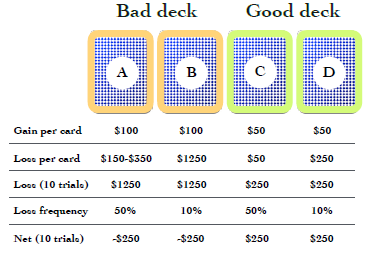

# Introduction
The Iowa Gambling task {cite:p}`bechara1994insensitivity` asses real-life decision making. Developed by researchers at the University of Iowa, subjects participate in a simulated card game. Participants are presented with 4 cards decks, with each deck more likely to reward or penalize them,  using game money i.e some decks are "bad" while others are "good". The subject's goal is to adapt their pattern of choices to maximize their reward received. 

## Description of Datasets
This investigation involves three datasets. Each dataset contains the parameters of a reinforcement model used to simulate a subject's cognitive actions in relation to decision making.
Overall, 153 subjects are represented with each subject being divided into young (18-34 years old, 90 individuals) or old (63-88 years old, 63 individuals).
 The model's parameters can be interrupted as several different psychological processes such as learnt behavior, impulsivity, stress reactions to punishments etc. Lili et al. describes three  models:

- Values-Plus-Perseverance Mode (VVP)
- Prospect Valence Learning Model with Delta (PVL-Delta)
- Outcome Representation Learning Mode (ORL)

:::{note}
Each reinforcement model's parameters are contained in one dataset. 
:::

In this investigation, we seek to use a variety of clustering approaches to segment the participants into well-defined groups. To start, we perform an initial data exploration to perform minimal transformations & data sanitization checks; acquire  rudimentary statistics of the datasets; measure cluster tendency and validate any assumptions required by our chosen clustering algorithms. Next, we perform cluster analysis  and evaluate our clusters using metrics such as Silhouette Coefficient and an Elbow curve. 
These clusters represent participants that exhibit similar decision-making patterns, captured by the parameters of the underlying reinforcement model. Finally, we conclude with the most important outcomes of our work. 